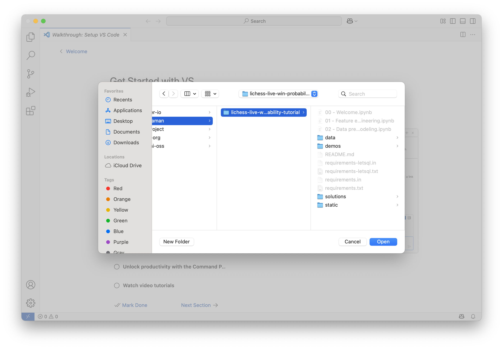
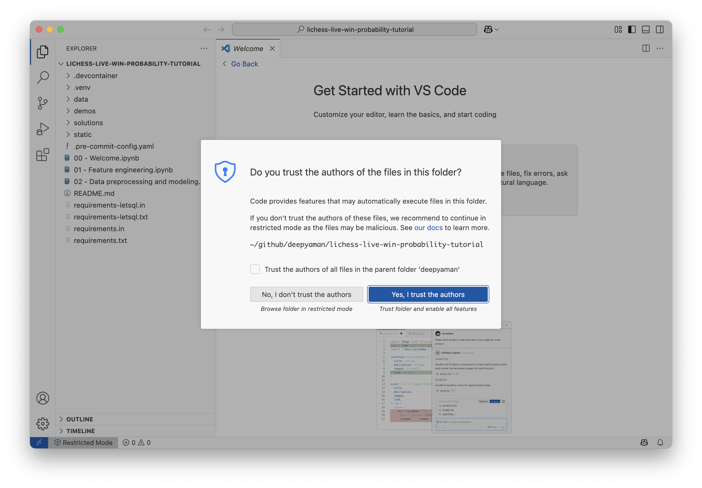
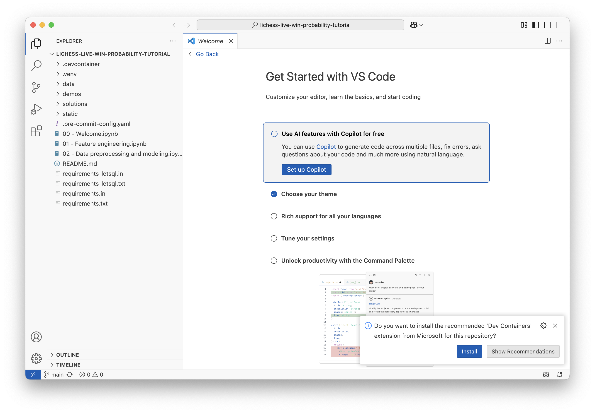
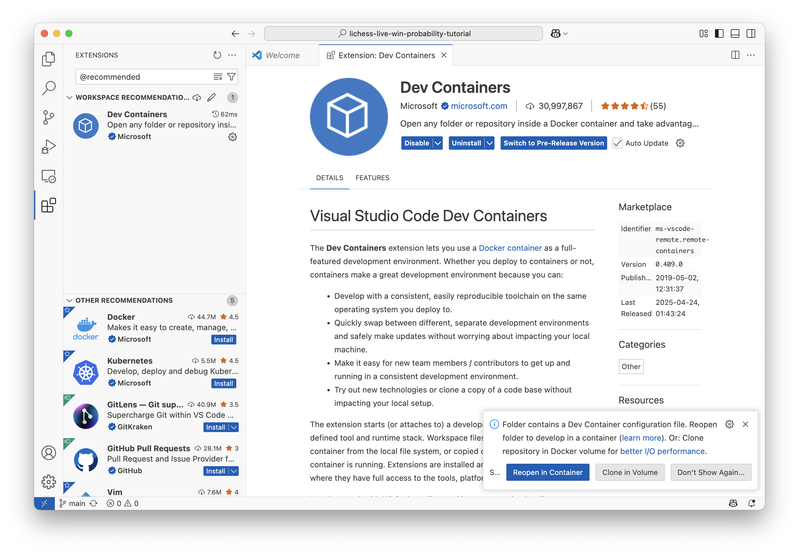
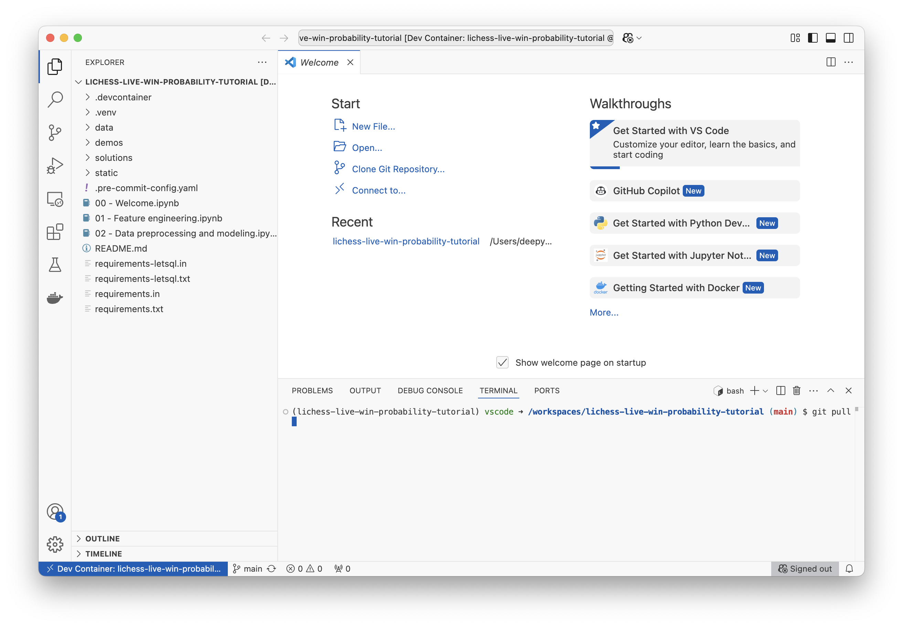
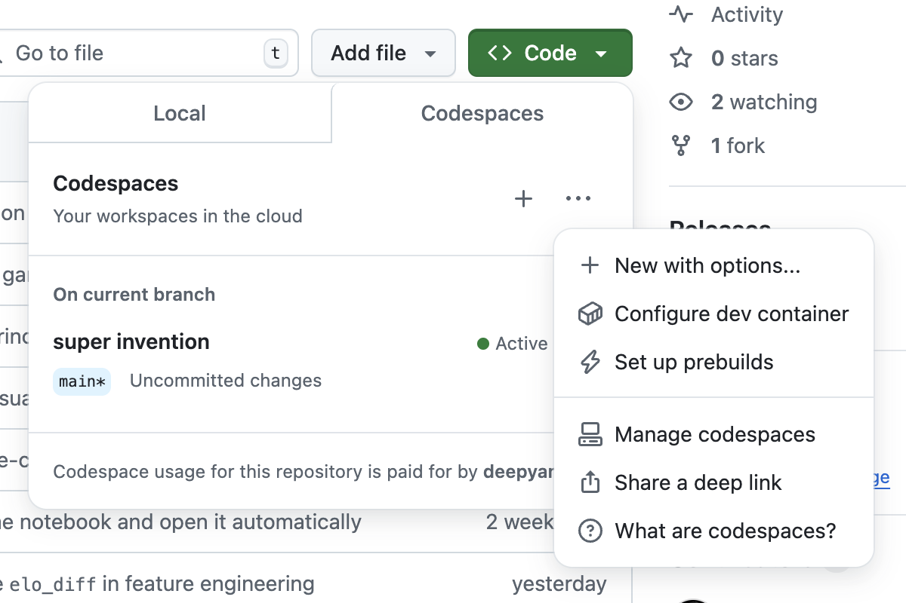
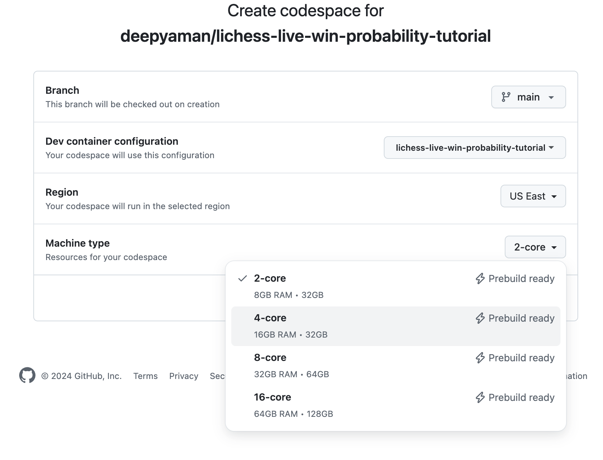
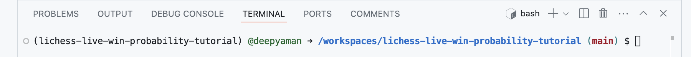
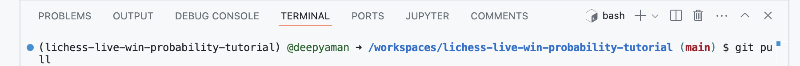

# Welcome to the Ibis and IbisML tutorial!

You can either run everything on your local machine using Visual Studio Code or in the cloud using GitHub Codespaces. If you anticipate you won't have reliable internet (e.g. at PyCon), the Visual Studio Code option is the way to go.

## Getting started using Visual Studio Code

To follow along, [download and install Visual Studio Code for your platform](https://code.visualstudio.com/docs/setup/setup-overview#_set-up-vs-code-for-your-platform) and set up your workspace:

1. Clone https://github.com/deepyaman/lichess-live-win-probability-tutorial

   ```bash
   git clone https://github.com/deepyaman/lichess-live-win-probability-tutorial.git
   ```

2. [Open the `lichess-live-win-probability-tutorial` folder](https://code.visualstudio.com/docs/getstarted/getting-started#_open-a-folder-in-vs-code)

   

3. Click "Yes, I trust the authors" to enable all features

   

4. Install the recommended 'Dev Containers' extension from Microsoft for the repository

   

5. Reopen the folder in a container

   

6. Run `git pull` in your terminal to ensure that you have the latest code

   

## Getting started using GitHub Codespaces

To follow along, create a GitHub Codespace on https://github.com/deepyaman/lichess-live-win-probability-tutorial:

1. Create a new codespace on `main`, making sure to choose "New with options..."

   

2. Create the codespace in US East (prebuild available) with at least 4 cores

   

3. Wait for the codespace to be fully initialized (you should see `(lichess-live-win-probability-tutorial)` at the start of your terminal prompt)

   

4. Run `git pull` in your terminal to ensure that you have the latest code

   
